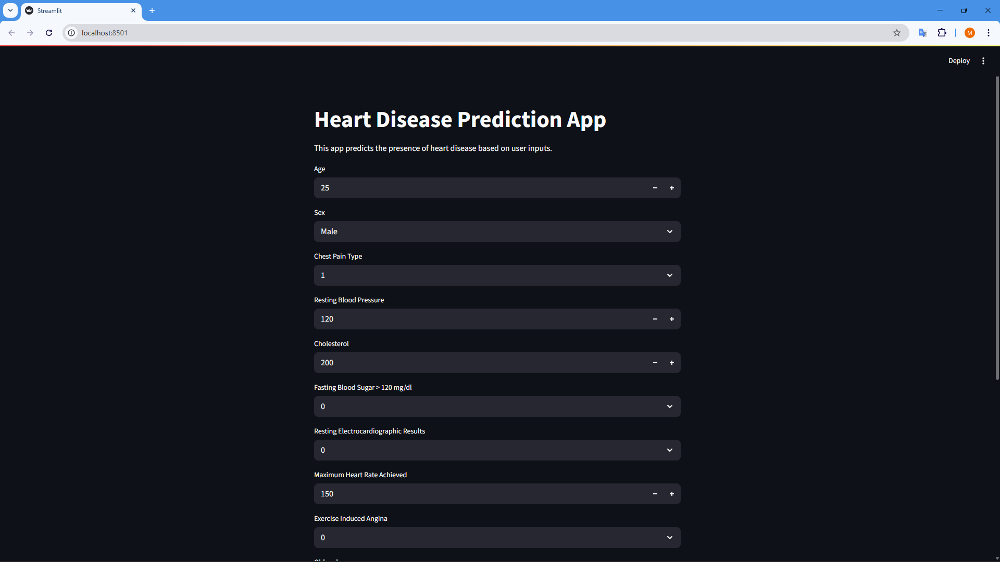
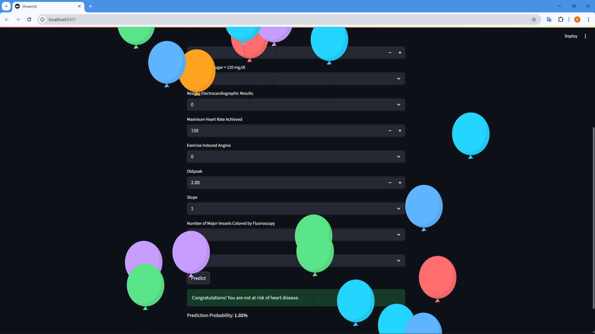

# End-to-End-Heart-Disease-Classification-Project

Predict heart disease risk using machine learning with data preprocessing, feature selection, PCA, classification models, clustering, and an interactive Streamlit app for real-time prediction and visualization.


This project includes:
- A **[Notebook](https://github.com/mazen-alasas/End-to-End-Heart-Disease-Classification-Project/tree/main/notebooks)** for each phase.
- A simple, user-friendly **Streamlit Web App** for real-time prediction.




## Table of Contents
- [About the Project](#about-the-project)
- [Dataset](#dataset)
- [Workflow Summary](#workflow-summary)
- [How to Run](#how-to-run)
- [Project Structure](#project-structure)
- [Results](#results)
- [Contact](#contact)


## About the Project
**Goal**: Predict the likelihood of a person having heart disease based on medical indicators.  
**Motivation**: Early detection of heart disease risk can help in preventive healthcare and timely medical intervention.


## Dataset
This project utilizes the **Heart Disease dataset** from the [UCI Machine Learning Repository](https://archive.ics.uci.edu/dataset/45/heart+disease).

Key features used:
* `age (29–77)`: Patient's age in years.
* `sex (1 = male, 0 = female)`: Gender of the patient.
* `cp (1–4)`: Chest pain type
  * 1: Typical angina
  * 2: Atypical angina
  * 3: Non-anginal pain
  * 4: Asymptomatic
* `trestbps (94–200)`: Resting blood pressure (mm Hg).
* `chol (126–564)`: Serum cholesterol (mg/dl).
* `fbs (1 = true, 0 = false)`: Fasting blood sugar > 120 mg/dl.
* **restecg (0–2)**: Resting electrocardiographic results
  * 0: Normal
  * 1: ST-T wave abnormality
  * 2: Left ventricular hypertrophy
* `thalach (71–202)`: Maximum heart rate achieved.
* `exang (1 = yes, 0 = no)`: Exercise-induced angina.
* `oldpeak (0.0–6.2)`: ST depression induced by exercise relative to rest.
* `slope (1–3)`: Slope of the peak exercise ST segment
  * 1: Upsloping
  * 2: Flat
  * 3: Downsloping
* `ca (0–3)`: Number of major vessels (0–3) colored by fluoroscopy.
* `thal (3, 6, 7)`: Thalassemia status
  * 3: Normal
  * 6: Fixed defect
  * 7: Reversible defect
* `num (0–4)`: Target variable 
  * 0: means no heart disease
  * 1–4: indicates increasing severity.


## Workflow Summary
1. **Data Loading & Cleaning** 
    - Loaded the **UCI Heart Disease dataset**, handled missing values, encoded categorical variables, and scaled numerical features.
2. **Exploratory Data Analysis (EDA)**
    - Visualized distributions, correlations, and outliers using histograms, boxplots, and heatmaps.
3. **Feature Engineering & Dimensionality Reduction**
    - Applied **PCA**, Feature Importance, **RFE**, and **Chi-Square** test to select key features.
4. **Model Training & Evaluation** 
    - Built **Logistic Regression**, **Decision Tree**, **Random Forest**, and **SVM** models; evaluated using accuracy, precision, recall, F1-score, and ROC-AUC.
5. **Hyperparameter Tuning**
    - Used **GridSearchCV** and **RandomizedSearchCV** to optimize model performance
6. **Model Export & Pipeline Creation**
    - Saved the trained model along with preprocessing steps as a `.pkl` file for deployment.
7. **Streamlit Web UI Preparation**
    - Developed the interface to collect user inputs, process data through the trained pipeline, and generate **real-time predictions**.

## How to run 
1. Clone the repository:
```bash
git clone https://github.com/mazen-alasas/End-to-End-Heart-Disease-Classification-Project.git
cd End-to-End-Heart-Disease-Classification-Project
```
3. (Optional) Create a virtual environment:
```bash
conda create -n heart_env python=3.12 -y
conda activate heart_env
```
4. Install dependencies:
```bash
pip install -r requirements.txt
```
5. Run the Streamlit app:
```bash
streamlit run app.py
```


## Project Structure
```plaintext
🗂️ End-to-End-Heart-Disease-Classification-Project
├── 📂 app/
│   └── app.py
├── 📂 models/
│   ├── model_pipline.joblib
│   ├── model_pipline.pkl
│   └── pipline_visual.pdf
├── 📂 notebooks/
│   ├── 1. data preprocessing.ipynb
│   ├── 2. dimensionality reduction.ipynb
│   ├── 3. feature selection.ipynb
│   ├── 4. supervised learning.ipynb
│   ├── 5. unsupervised learning.ipynb
│   └── 6. hyperparameter tuning.ipynb
├── .gitignore
├── README.md
└── requirements.txt
```


## Results
* The model provides a probability score indicating the likelihood of heart disease.
* Output example:
  * **Low Risk:** Probability < 0.5
  * **High Risk:** Probability ≥ 0.5


## Contact
Created by [Mazen Ahmed Alasas](https://github.com/mazen-alasas) - feel free to reach out!
  
[](https://www.linkedin.com/in/mazen-alasas/)
[](https://www.youtube.com/@mazen_labs)
